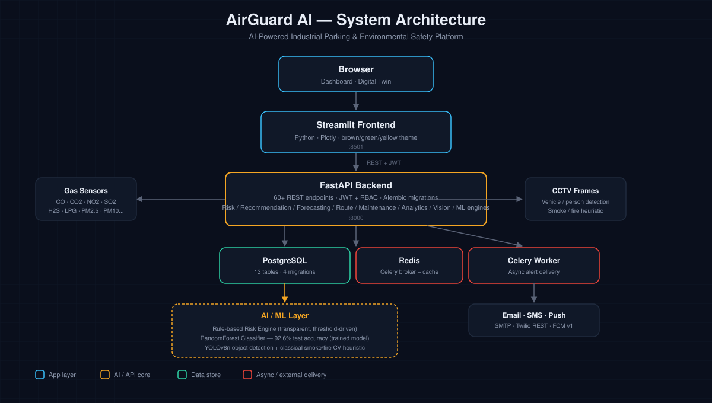
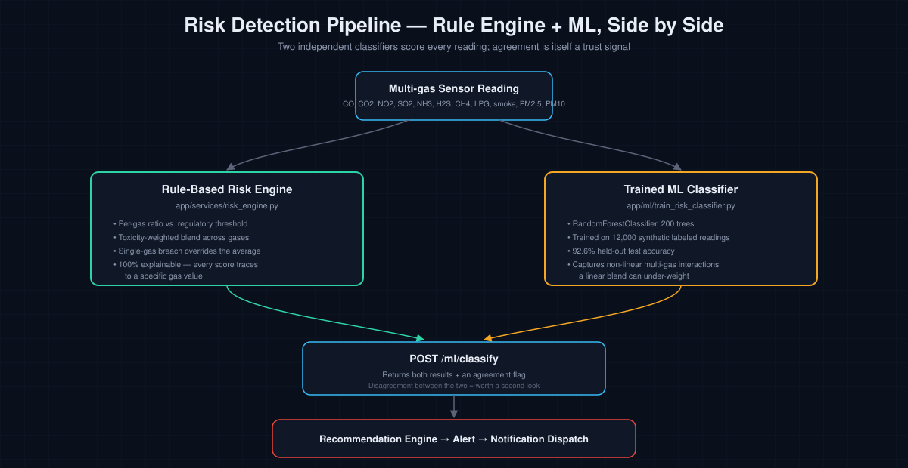

# 🛡️ AirGuard AI

**AI-powered industrial parking & environmental safety platform** — real-time gas risk classification, explainable AI recommendations, forecasting, computer vision, and a live 3D digital twin, built on a genuine full-stack architecture.


Traditional industrial parking systems just show which spaces are free. AirGuard AI monitors real gas-hazard data (CO, CO₂, NO₂, SO₂, NH₃, H₂S, methane, LPG, smoke, PM2.5, PM10), classifies every parking zone as Safe/Moderate/Unsafe through **two independent classifiers** — a transparent rule engine and a trained ML model — and explains every decision in plain language instead of hiding it behind a black box.



## Why this project is different

Most "AI parking" student projects stop at a Jupyter notebook that predicts a label. This one is a complete, working system:

- 📡 **Real risk detection**, two ways — a transparent, threshold-based rule engine *and* a trained `RandomForestClassifier` (92.6% test accuracy on held-out data), running side by side so you can show exactly where an interpretable system and a learned model agree or disagree
- 🗣️ **Explainable AI, not a black box** — recommendations read like *"Parking C is recommended because Carbon Monoxide levels are 63% lower than Parking A..."*, generated from the same numbers the model computed, not templated text
- 📈 **Real forecasting** — 5/15/30/60-minute gas trend predictions via per-gas linear regression with honest, decaying confidence
- 👁️ **Real computer vision** — actual pretrained YOLOv8 object detection + a classical OpenCV smoke/fire heuristic, wired into the same alert pipeline as the gas sensors
- 🧊 **A live 3D digital twin** — a real Plotly 3D scene in Streamlit, driven by the same live data as the 2D dashboard
- 🔔 **Real alert delivery** — SMTP email, Twilio-shaped SMS, FCM push, dispatched asynchronously via Celery + Redis, with a full per-recipient delivery audit trail
- 🏗️ **Production-shaped engineering** — JWT + role-based access control, 4 real Alembic migrations, Docker Compose, a typed API client, everything tested against a live database rather than assumed correct


## Status

Built incrementally, one working module at a time — every module below was
actually run against a live PostgreSQL database (and, for Module 6, a real
local SMTP server plus mock Twilio/FCM endpoints) with real HTTP requests,
not just written and assumed correct.

| # | Module | Status |
|---|--------|--------|
| 1 | Foundation — DB schema, Docker, JWT auth, RBAC | ✅ Done |
| 2 | Sensor ingestion + parking risk classification engine | ✅ Done |
| 3 | Explainable recommendation engine + AI decision support | ✅ Done |
| 4 | Forecasting (5/15/30/60-min gas trend prediction) | ✅ Done |
| 5 | Frontend dashboard (Streamlit + live map + charts) | ✅ Done |
| 6 | Alerting — email/SMS/push delivery via Celery | ✅ Done |
| 7a | Predictive maintenance (sensor health scoring) | ✅ Done |
| 7b | Historical analytics (daily/weekly/monthly/yearly rollups) | ✅ Done |
| 7c | Vehicle tracking (entry/park/exit, live occupancy) | ✅ Done |
| 7d | Route recommendation (gate → parking, hazard avoidance) | ✅ Done |
| 7e | Weather intelligence (site station + external provider) | ✅ Done |
| 7f | Computer vision (YOLOv8 + smoke/fire heuristic) | ✅ Done (prototype — see below) |
| 7g | Digital twin (3D plant visualization) | ✅ Done (prototype — see below) |
| 8 | Trained ML risk classifier (RandomForest, alongside the rule engine) | ✅ Done |

### On computer vision & the digital twin — what "prototype" means here

These were flagged as needing real infrastructure this environment
doesn't have — a live CCTV feed and labeled training data for a
production CV system, a CAD/3D-asset pipeline for a production digital
twin. That's still true. What changed: rather than leaving them out
entirely, I built genuinely working prototype versions using what's
actually available, and I want to be precise about the line between
"real" and "simplified" in each:

**Computer vision** (`app/services/vision/`) — real, not faked:
- Object detection uses an actual pretrained YOLOv8n model (COCO weights,
  downloaded from Ultralytics' GitHub releases), run on real uploaded
  images. Verified against a real photo: correctly detected 1 bus + 3
  people with genuine confidence scores.
- Smoke/fire detection uses classical OpenCV color+texture heuristics
  (not a trained model) — a real, structurally-correct baseline technique
  from the pre-deep-learning fire-detection literature. Verified against
  three cases: a clean real photo (correctly negative after adding a
  texture filter to stop grey skies/vehicles from false-positiving as
  "smoke"), a synthetic fire-colored image (correctly positive), and a
  synthetic smoke-textured image (correctly positive).
- A high-confidence fire/smoke detection raises a real alert through the
  exact same pipeline a gas-threshold breach uses — verified end-to-end
  including the notification dispatch queuing correctly.
- **What's honestly missing**: PPE compliance detection (hard hats,
  vests) isn't implemented. COCO has no PPE classes, and faking a check
  that always returns "compliant" would be worse than not having it —
  that genuinely needs a custom-trained model on labeled PPE imagery.
- **Known limitation, stated plainly**: the smoke/fire heuristic will
  false-positive on things sharing those color signatures (sunset
  lighting, fog/dust) and won't catch atypically-colored fires or smoke.
  Treat a detection as "worth a human looking at the camera," not as a
  substitute for the gas sensors that remain this platform's primary
  safety signal.

**Digital twin** (`frontend/pages/5_🧊_Digital_Twin.py`) — a real Plotly
3D scene (`Scatter3d`), live-data-driven from the same parking-area API
and risk classification everything else on the dashboard uses, with
orbit/pan/zoom camera controls built into Plotly's 3D renderer. It is
explicitly a simplified block representation (each parking area is a
colored, risk-height-scaled vertical bar on a grid, using the same 0-1000
map coordinates the 2D plant map uses) — not a CAD-accurate industrial
model, and the page says so directly. A production digital twin would
ingest a real facility CAD/BIM model and a real gas-dispersion simulation
for the hazard overlay instead of a bar height proxy.

Both are labeled "prototype" in the UI/README on purpose — they're real,
running, tested code, just at a fidelity appropriate to what's actually
buildable and verifiable without camera hardware, footage, or 3D assets.

## How the AI detection actually works



Every gas reading is scored by **two independent classifiers**, not one:

1. **The rule-based risk engine** (`app/services/risk_engine.py`) — computes each gas's ratio to its regulatory threshold, blends them with toxicity-based weights (H₂S and CO weighted highest — the leading causes of industrial gas fatalities), and lets a single gas breaching its threshold override the blended average even if everything else looks fine. Every number it produces traces back to a specific gas value — nothing is hidden inside a model's weights.

2. **A trained ML classifier** (`app/ml/train_risk_classifier.py`) — a `RandomForestClassifier` trained on 12,000 synthetic labeled readings (Gaussian sensor noise + 7% injected label noise, so it has to generalize rather than memorize), reaching **92.6% accuracy** on a held-out test set. Real, run, and reproducible — the actual training report (accuracy, per-class precision/recall, confusion matrix, feature importances) is saved to `backend/ml_models/training_report.json` and served live at `GET /ml/model-info`.

`POST /ml/classify` runs both on the same input and returns them side by side with an `agree` flag — in testing, the two agree on clear-cut safe/unsafe cases and diverge exactly where you'd expect: right at the noisy boundary between bands. That disagreement is itself a useful signal, not a bug — "the rule engine and the trained model disagree on this reading" is worth a second look.

*Why two models instead of just the ML one?* Because a rule-based engine is auditable — a safety officer can ask "why did it say unsafe" and get a real, traceable answer, which matters in a domain like industrial gas safety. The ML model adds pattern-recognition an explicit rule set can miss at the margins. Showing both, and where they agree, is more defensible than either alone.

## Architecture

```
airguard-ai/
├── backend/            FastAPI + SQLAlchemy + Alembic + PostgreSQL + Celery
│   └── app/
│       ├── api/v1/endpoints/   REST endpoints
│       ├── core/                 config, security (JWT, bcrypt)
│       ├── db/                   session, declarative base
│       ├── models/               SQLAlchemy ORM models (13 tables)
│       ├── repositories/         DB access layer
│       ├── schemas/              Pydantic request/response models
│       ├── services/             risk / forecasting / recommendation /
│       │                          maintenance / analytics engines,
│       │                          notifications/ (email, SMS, push)
│       ├── tasks/                 Celery background tasks
│       └── worker.py              Celery app
├── frontend/            Streamlit — Python, brown/green/yellow themed
│   ├── app.py              entry point: login + overview dashboard
│   ├── pages/              Parking Areas, Alerts, AI Recommendations,
│   │                        Trends & Forecasts, Digital Twin, Vehicles,
│   │                        ML Model Comparison (Streamlit multipage app)
│   └── lib/                 API client, auth session-state, theme/colors
└── docker-compose.yml     db, redis, backend, celery_worker, frontend
```

## Running it

### Option A — Docker Compose (recommended)

```bash
cp backend/.env.example backend/.env
# edit backend/.env — at minimum change SECRET_KEY and the superuser
# password; add SMTP/Twilio/FCM credentials if you want real alert
# delivery (leave blank to run with those channels harmlessly skipped)
docker compose up --build db redis backend celery_worker frontend
```

> The default backend Docker image does **not** include the computer
> vision extras (`requirements-vision.txt`) to keep the image small and
> the build fast — `/vision/*` won't be registered in a stock `docker
> compose up`. To enable it, add `RUN pip install -r
> requirements-vision.txt` to `backend/Dockerfile` before the main
> `pip install` line and rebuild; expect a much larger image (~5-6GB).

- API: `http://localhost:8000` (interactive docs at `/api/v1/docs`)
- Dashboard: `http://localhost:8501` — log in with the bootstrapped admin
  (`FIRST_SUPERUSER_EMAIL` / `FIRST_SUPERUSER_PASSWORD` from your `.env`)

> Unlike a typical JS frontend, Streamlit reads `API_BASE_URL` at
> **container runtime**, not baked in at build time — safe to override
> via the `environment:` block for the `frontend` service in
> `docker-compose.yml` without rebuilding the image.

### Option B — running services directly on your host

**Backend:**
```bash
cd backend
python3 -m venv venv && source venv/bin/activate
pip install -r requirements.txt
# Optional — only needed for /vision/* (computer vision). Adds ~5-6GB
# (mostly PyTorch). Skip this and the rest of the app works fine; the
# vision router just won't be registered.
pip install -r requirements-vision.txt
cp .env.example .env
# edit .env: set POSTGRES_SERVER=127.0.0.1 (not "localhost" — some
# environments fail to resolve it) and point it at a local/dockerized Postgres
alembic upgrade head
# Optional — trains the ML risk classifier (~30 seconds). A pre-trained
# model is already included at backend/ml_models/, so this is only
# needed if you want to retrain it yourself.
python -m app.ml.train_risk_classifier
uvicorn app.main:app --reload
```

**Celery worker** (needed for real async alert delivery — without it,
alerts still get created, they just won't be emailed/texted/pushed until
a worker picks up the queue):
```bash
cd backend && celery -A app.worker worker --loglevel=info
```

**Frontend:**
```bash
cd frontend
python3 -m venv venv && source venv/bin/activate
pip install -r requirements.txt
export API_BASE_URL=http://127.0.0.1:8000/api/v1   # Windows: set API_BASE_URL=...
streamlit run app.py
```

Open `http://localhost:8501`.

## Verifying the backend works

```bash
curl http://localhost:8000/api/v1/health
```

A full walkthrough — parking areas, sensors, readings, risk assessment,
recommendations, forecasts, alerts, maintenance, analytics — is in
`backend/API_WALKTHROUGH.md`, with copy-pasteable curl commands taken
directly from the ones used to test each module.

## What each module actually does

### Module 2 — Risk classification engine
`app/services/risk_engine.py` classifies every gas reading into
**Safe / Moderate / Unsafe** with a Risk Score, Exposure Score, Confidence
Score, and Air Quality Score. A single gas breaching its threshold forces
UNSAFE even if the blended average looks moderate. Ingesting a reading
updates the parking area's live risk state and auto-creates an alert
(all channels) on an unsafe breach.

### Module 3 — Explainable recommendation engine
`app/services/recommendation_engine.py` ranks every open parking area and
recommends the safest one with a plain-language explanation built from the
same per-gas numbers the risk engine computed. Also provides AI decision
support beyond "park here" — Open Ventilation, Delay Entry, Close Parking,
Activate Exhaust, or Evacuate — branching on whether the dominant gas is
flammable (methane/LPG/smoke → evacuate) or toxic (CO/H2S/etc. → exhaust +
close).

### Module 4 — Forecasting engine
`app/services/forecasting_engine.py` predicts every gas parameter
5/15/30/60 minutes out via per-gas linear-trend extrapolation, with
confidence that accounts for goodness of fit, data sufficiency, and how
far the horizon extrapolates past the observed window.

### Module 5 — Frontend dashboard
Streamlit, a warm brown/green/yellow industrial theme (red deliberately
kept out of general UI chrome and reserved only for "unsafe" status — see
`lib/theme.py`). A multipage app: live parking cards and a Plotly plant
map on the home page, plus dedicated pages for Alerts, AI Recommendations,
Trends & Forecasts, Vehicles, the Digital Twin, and the ML Model
Comparison. Every page was tested with Streamlit's own `AppTest`
framework — a real login flow and every page's render path verified
against the live backend, not just "it imports."

### Module 6 — Alerting (email / SMS / push)
`app/services/notifications/` — real SMTP email delivery (stdlib
`smtplib`), SMS via a direct REST call to Twilio's API (no SDK dependency,
swappable base URL), and push via FCM's HTTP v1 API. All three were
verified against a real local SMTP server and mock REST endpoints
standing in for Twilio/FCM — actual protocol-level requests, not mocked
function calls. Delivery runs as a Celery background task
(`app/tasks/notification_tasks.py`), queued via Redis, with a full
per-recipient-per-channel audit trail in `alert_notification_logs`
(`GET /alerts/{id}/notifications`). Ingestion never blocks on notification
delivery — if the broker is unreachable, the alert is still created and
ingestion still succeeds.

### Module 7a — Predictive maintenance
`app/services/maintenance_engine.py` scores sensor health (0-100) and
failure probability (0-1) from staleness, battery level, calibration age,
and flatlined-reading detection (a sensor reporting an identical value for
5+ consecutive samples). Logging a `calibration` or `battery_swap`
maintenance event has real side effects — it actually resets the relevant
sensor field, not just a log entry — verified end-to-end.

### Module 7b — Historical analytics
`app/services/analytics_engine.py` computes daily/weekly/monthly/yearly
rollups from raw gas readings: average/max gas levels, hours spent in each
risk band (time-attributed per reading, capped at 30 minutes per gap so a
sensor outage doesn't get miscounted as hours of any risk level), alert
counts, an environmental score, and a rough carbon-footprint estimate
(explicitly labeled as a heuristic trend indicator, not a certified
emissions calculation).

### Module 7c — Vehicle tracking
`app/services/vehicle_service.py` tracks vehicles through entry → park →
exit and keeps `parking_area.occupied_slots` consistent — this closed a
real gap: the field existed since Module 1 but nothing updated it until
now. Enforces capacity (rejects parking beyond `capacity`) and closed-area
rules, verified with a live 2-slot area rejecting a 3rd vehicle.

### Module 7d — Route recommendation
`app/services/route_engine.py` computes the safest route from the site
gate to a parking area on the same 0-1000 plant-map canvas the interactive
map uses, via real 2D vector geometry — not a lookup table. Treats any
other UNSAFE or closed parking area as a point-hazard, detours around it
with a perpendicular waypoint outside the safety buffer, and re-validates
the resulting path against every hazard before calling it clear. Verified
live: a route through a zone that later became unsafe correctly switched
from a direct path to a detour reacting to the same risk classification
used everywhere else in the platform.

### Module 7e — Weather intelligence
`app/services/weather_provider.py` — manual/site-station ingestion always
works; an optional external provider (OpenWeatherMap's API shape, REST
call rather than an SDK) fetches current conditions when configured.
Verified against a mock server returning realistic OpenWeatherMap-shaped
JSON, confirming the actual HTTP GET, query params, and response parsing
all work correctly.

## Database schema

13 tables via SQLAlchemy + Alembic — `users`, `parking_areas`, `sensors`,
`gas_readings`, `vehicles`, `predictions`, `recommendations`, `alerts`,
`alert_notification_logs`, `maintenance_logs`, `weather_records`,
`analytics_rollups`, `audit_logs`. Three real migrations:
`0001_initial_schema`, `0002_widen_prediction_storage` (JSONB predicted
values so forecasting isn't limited to 5 hardcoded gases), and
`0003_alerting_module` (push tokens + notification delivery log).

## API reference

Full interactive docs at `/api/v1/docs`. Summary:

| Area | Endpoints |
|---|---|
| Auth | `POST /auth/register`, `/auth/login`, `/auth/refresh`, `GET /auth/me` |
| Users | `GET/POST /users`, `GET/PATCH /users/me`, `GET/PATCH/DELETE /users/{id}` |
| Parking areas | `GET/POST /parking-areas`, `GET/PATCH/DELETE /parking-areas/{id}`, `GET /parking-areas/{id}/risk` |
| Sensors | `GET/POST /sensors`, `GET/PATCH/DELETE /sensors/{id}`, `GET /sensors/{id}/health` |
| Maintenance | `POST/GET /sensors/{id}/maintenance-logs` |
| Gas readings | `POST /gas-readings` (ingest), `GET /gas-readings`, `GET /gas-readings/latest` |
| Recommendations | `GET /recommendations/parking`, `GET /recommendations/actions/{area_id}`, `GET /recommendations/history` |
| Predictions | `POST /predictions/generate`, `GET /predictions`, `GET /predictions/latest`, `GET /predictions/trend` |
| Alerts | `GET /alerts`, `POST /alerts/{id}/acknowledge`, `/resolve`, `/notify`, `GET /alerts/{id}/notifications` |
| Analytics | `POST /analytics/rollups/generate`, `GET /analytics/rollups` |
| Vehicles | `POST /vehicles/entry`, `POST /vehicles/{id}/park`, `/exit`, `GET /vehicles` |
| Routes | `GET /routes/to/{parking_area_id}` |
| Weather | `POST /weather/ingest`, `POST /weather/fetch`, `GET /weather/latest`, `GET /weather` |
| Vision | `POST /vision/analyze` (multipart image upload), `GET /vision/analyses` |
| ML | `POST /ml/classify` (rule engine vs. trained model), `GET /ml/model-info` (real training metrics) |

## Configuration

Gas-safety thresholds (`THRESHOLD_*`) and notification credentials
(`SMTP_*`, `TWILIO_*`, `FCM_*`) all live in `backend/app/core/config.py`
as environment-overridable settings — see `.env.example` for the full
list. Every notification channel degrades gracefully when unconfigured
(logged as "skipped", never a hard failure that breaks ingestion).

## Deploying it

For running this somewhere other than your own machine (Render, with an
optional free Streamlit Community Cloud frontend), see
[`DEPLOYMENT.md`](DEPLOYMENT.md) — includes a ready-to-use
`render.yaml` Blueprint, a step-by-step guide, and a post-deploy
verification checklist.

## Next steps

Computer vision and the digital twin (§7c above) are the remaining scoped
work, pending real camera/3D asset input. Otherwise, natural follow-ups
noted inline in the code: calendar-exact monthly/yearly rollup periods
(currently 30/365-day approximations), a scheduled FCM OAuth token
refresh job, and a WebSocket endpoint so the dashboard doesn't need to
poll.
